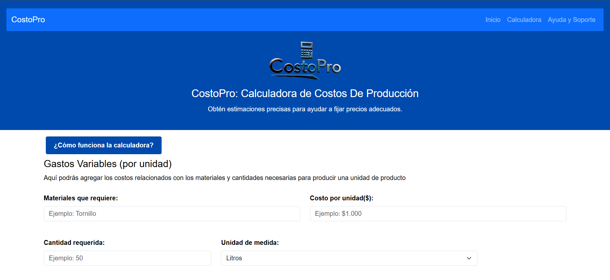
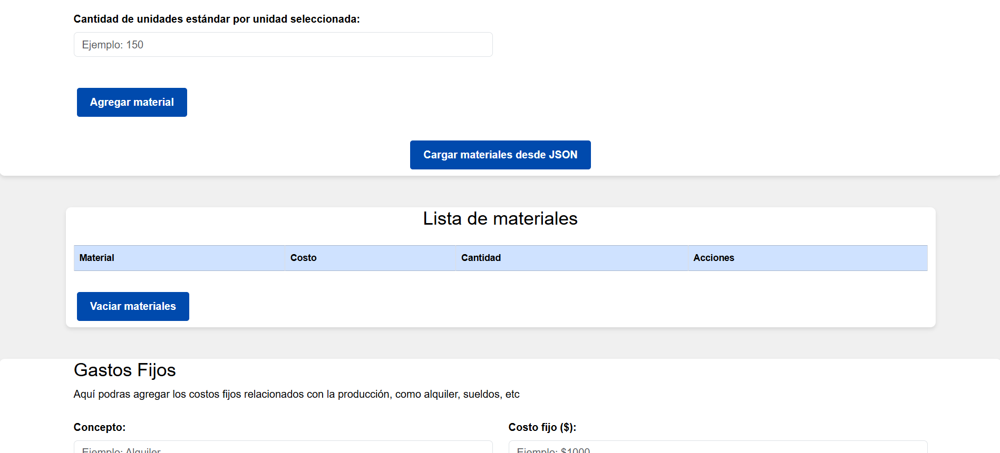
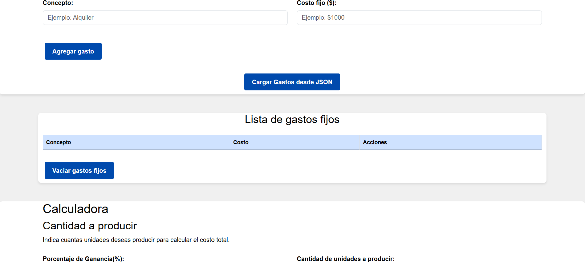
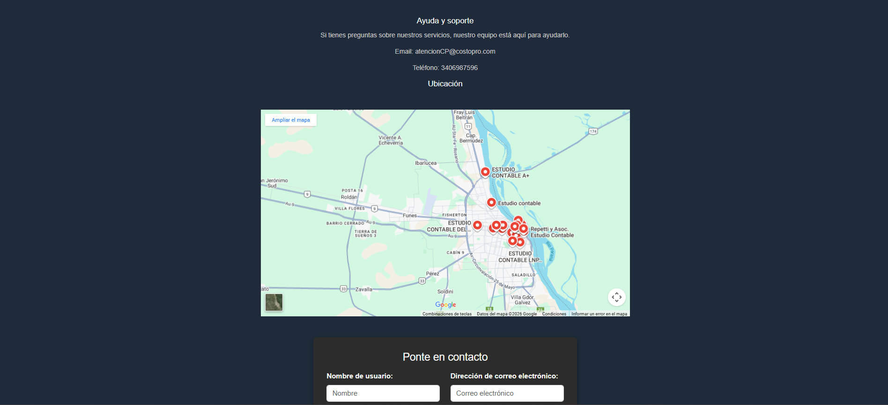

# CostoPro : Calculadora de Costos de Producción

## Descripción
CostoPro es una herramienta web interactiva diseñada para ayudar a calcular los costos asociados a la producción de un producto. 
El simulador permitirá a los usuarios ingresar datos sobre materiales, gastos fijos, calculando el costo total de producción y proporcionando un desglose detallado de los mismos.
Esta herramienta está orientada a optimizar el proceso de planificación y estimación de costos para proyectos de producción. 

---

[Versión desplegada y disponible para uso online](https://candegodoy0.github.io/Proyecto-CostoPro/)

---

## Objetivos del proyecto 
- Desarrollar una página web interactiva para calcular los costos de producción de un producto.
- Permitir a los usuarios ingresar información sobre materiales y otros costos.
- Calcular y mostrar el costo total de producción, por unidad de producto, incluyendo una división detallada de los costos involucrados.
- Ofrecer un espacio para mejorar y agregar más funcionalidades, como la gestión de presupuestos, en futuras entregas.

---

## Tecnologías Utilizadas
- HTML5: Para estructurar la página web.
- CSS: Para el diseño y la estilización.
- JavaScript: Para implementar las funcionalidades interactivas del simulador.
- Bootstrap 5: Framework CSS para diseño responsivo.

---

## Funcionalidades previstas
- Ingreso de datos sobre materiales y costos asociados.
- Cálculo automático del costo total y por unidad basado en los datos ingresados.
- Desglose de los costos fijos, materiales y otros gastos.

---

## Maqueta de Diseño Web
El diseño de la página incluirá una interfaz sencilla y clara que permita a los usuarios interactuar fácilmente con las distintas herramientas del simulador. Se planea una disposición en columnas con formularios para ingresar los datos y una sección separada donde se mostrarán los resultados calculados.

Puedes ver el prototipo del mockup [aquí](https://www.canva.com/design/DAGh8ePo5lA/f8PBcSXs0Y3Je0_3SCwQHQ/edit?utm_content=DAGh8ePo5lA&utm_campaign=designshare&utm_medium=link2&utm_source=sharebutton).

---

## Diagrama de Flujo
El siguiente diagrama representa el algoritmo principal de la aplicación, incluyendo entradas, procesos, decisiones y salidas.

[Ver diagrama de Flujo](https://drive.google.com/file/d/1Yv0KHfX70MYScOEtr9NniePTkI21eynK/view?usp=sharing)

---

## Diagrama de Clases
El diagrama muestra las clases, sus propiedades, métodos y relaciones, reflejando la estructura del código. Ayuda a comprender la lógica del simulador y su escalabilidad.

[Ver diagrama de Clases](https://drive.google.com/file/d/1MiHFjw6tcudcweqcTY5JpL-WYaUtxc_W/view?usp=sharing)

---

## Capturas de la interfaz

A continuación se muestran algunas vistas representativas de la página:

  
  
  
  
  

---

## 📁 Estructura del proyecto

